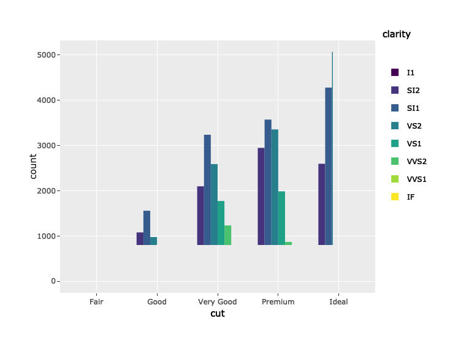

``` r
# Source: http://www.htmlwidgets.org/showcase_plotly.html
library(plotly)
```

    ## Loading required package: ggplot2

    ## 
    ## Attaching package: 'plotly'

    ## The following object is masked from 'package:ggplot2':
    ## 
    ##     last_plot

    ## The following object is masked from 'package:stats':
    ## 
    ##     filter

    ## The following object is masked from 'package:graphics':
    ## 
    ##     layout

``` r
p <- ggplot(data = diamonds, aes(x = cut, fill = clarity)) +
            geom_bar(position = "dodge")
ggplotly(p)
```


